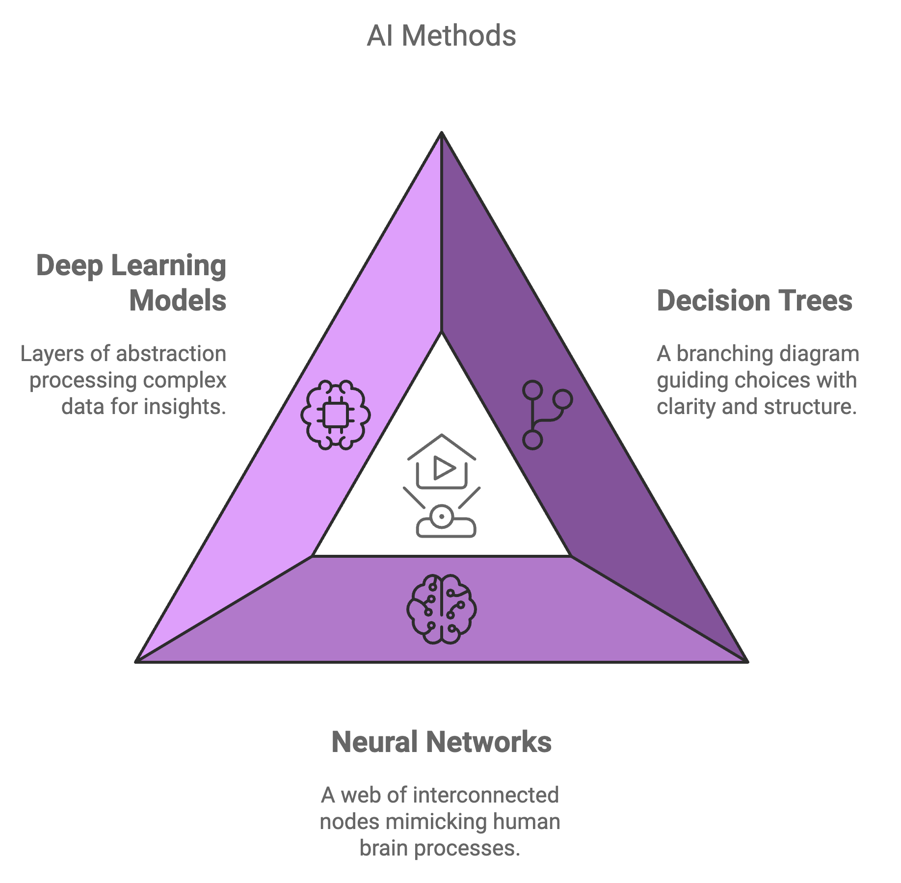

# Introduction to Artificial Intelligence

Artificial Intelligence (AI) has become one of the most transformative technologies of our time, influencing nearly every aspect of our daily lives. But what exactly is AI?&#x20;

In simple terms,

>AI refers to the ability of machines to perform tasks that would normally require human intelligence. These tasks include recognizing speech, making decisions, learning from experience, and solving problems.

AI can be thought of as a broad field that encompasses various technologies, including machine learning, natural language processing, robotics, and computer vision. While some of these terms may sound complex, the impact of AI can be seen in the simplest of ways throughout our daily routines.

### What is Artificial Intelligence?

AI is the simulation of human intelligence by machines. Essentially, it involves using algorithms and data to make computers perform tasks that, until recently, only humans were capable of doing. AI systems can be rule-based, meaning they follow a set of predefined commands, or they can learn and adapt based on new information, as in the case of machine learning.

AI is not a singular technology but a collection of methods that enable machines to perceive, reason, and act. These methods include techniques like decision trees, neural networks, and deep learning models, which help computers make sense of data and respond intelligently.

### Simple Examples of AI in Everyday Life

You might not realize it, but AI is everywhere around you. Here are some simple and common examples of AI that you interact with every day:

1. **Virtual Assistants**: AI powers virtual assistants like Siri, Alexa, and Google Assistant. These tools use natural language processing to understand your voice commands and respond accordingly. Whether you're asking about the weather, setting a reminder, or requesting a song, AI makes these interactions possible.

2. **Recommendation Systems**: When you watch a movie on Netflix or buy something on Amazon, you are likely to see suggestions for other things you might like. These personalized recommendations are made possible by AI, which analyzes your preferences and behavior to recommend relevant content or products.

3. **Email Filtering**: Have you ever wondered how your email automatically filters spam messages? AI algorithms analyze incoming emails and identify potential spam, moving them out of your inbox to keep things tidy.

4. **Navigation Apps**: Apps like Google Maps use AI to provide route optimization and predict traffic conditions. They take into account real-time data from millions of users to help you find the fastest way to your destination.

5. **Autocorrect and Predictive Text**: When you type a message on your smartphone, AI helps by correcting your spelling errors and predicting what you might want to say next. This type of AI makes typing faster and more efficient.

### Conclusion

AI is not just some distant, futuristic technology—it is here, shaping the world in ways that are both profound and practical. From helping us find our way home to entertaining us with personalized content, AI has seamlessly integrated into our daily lives, often without us even noticing. As we continue to explore the capabilities of AI, understanding these basic concepts will help us appreciate how much it contributes to the convenience and efficiency of modern living.

