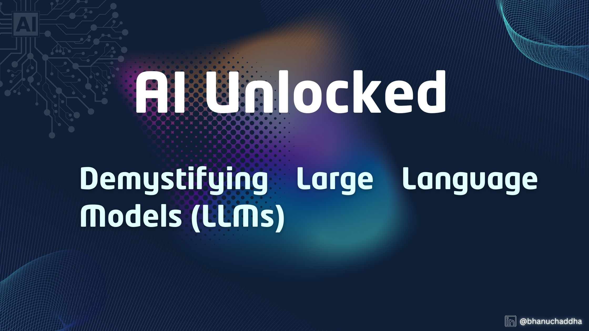

# AI Unlocked: Demystifying Large Language Models

Welcome to "AI Unlocked: Demystifying Large Language Models," an in-depth series designed to unravel the complexities of Large Language Models (LLMs). Whether you're just starting out in the AI field or you have some experience but are curious about the inner workings of these advanced models, this series aims to provide clear, practical insights that will help you understand and work with LLMs effectively.

In this series, we'll explore the foundations of LLMs, dive into how they are trained, understand their limitations, and reveal the various ways they can be applied across industries. From an introduction to the architecture of these models, to hands-on examples of how LLMs can solve real-world problems, each article will break down key concepts into digestible parts, so you can follow along at your own pace.

Below, you'll find a list of all the articles in this series. Each link will take you one step closer to mastering the art of working with LLMs.

[1. Introduction to Artificial Intelligence](1.%20Introduction%20to%20Artificial%20Intelligence.md)

Stay tuned as we continue to unlock the full potential of LLMs, one post at a time.

