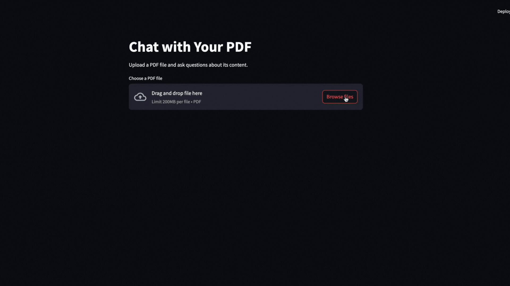

## Chat with PDF App using RAG, EmbedChain, and Streamlit

### Introduction

Imagine having the ability to upload a PDF and interact with it through a chat interface, asking questions and receiving instant answers based on the document's content. This is possible by combining **Retrieval-Augmented Generation (RAG)**, **EmbedChain**, and **Streamlit**.

In this tutorial, we will build a "Chat with PDF" app that allows users to upload a PDF file and ask questions about its contents. We'll use **EmbedChain** for embedding the document's content and retrieving relevant text and **Streamlit** to create an intuitive, interactive user interface.

---

### Understanding the Technologies

#### 1. Retrieval-Augmented Generation (RAG)
**RAG** is an approach that combines two powerful methods:
- **Retrieval-based systems**: It searches for relevant data from a knowledge base or document, making it suitable for tasks that require accurate responses from a specific dataset.
- **Generative models**: These models generate text based on the retrieved data, allowing us to interact with the data in natural language.

With RAG, we can build applications that respond accurately to user queries by pulling the exact content needed from a PDF document.

#### 2. EmbedChain
**EmbedChain** is an open-source framework that simplifies creating and deploying personalized AI applications with a focus on embedding large datasets. It manages:
- Loading unstructured data, like PDF content.
- Chunking, embedding, and storing data in a vector database for optimized retrieval.
EmbedChain lets us extract relevant information from the PDF content, enabling quick access to specific sections based on user queries.

#### 3. Streamlit
**Streamlit** is a popular Python library for creating interactive, web-based applications. It’s ideal for data-driven and AI applications, allowing us to easily add interactivity and a polished look to our "Chat with PDF" app.

---

### Setting Up the Environment

First, make sure you have Python installed. Then, install the required libraries by running:

```bash
pip install -r requirements.txt
```

Create a `requirements.txt` file with the following content:

```
embedchain
streamlit
```

---

### Step-by-Step Implementation

#### Step 1: Import the Necessary Libraries

We'll begin by importing the required libraries:

```python
import streamlit as st
from embedchain import App
```

#### Step 2: Initialize the EmbedChain Application

Now, we’ll initialize an EmbedChain instance that will handle embedding and querying the PDF content:

```python
app = App()
```

#### Step 3: Define the Streamlit Application

Next, we’ll set up the Streamlit application. Here, users can upload a PDF and ask questions about its content.

```python
def main():
    st.title("Chat with Your PDF")
    st.write("Upload a PDF file and ask questions about its content.")

    # File uploader
    pdf_file = st.file_uploader("Choose a PDF file", type="pdf")

    if pdf_file is not None:
        # Save the uploaded PDF to a temporary location
        with open("uploaded_file.pdf", "wb") as f:
            f.write(pdf_file.getbuffer())

        # Add the PDF to the EmbedChain app
        app.add("uploaded_file.pdf", data_type="pdf_file")

        st.success("PDF content has been embedded successfully!")

        # Input for user queries
        query = st.text_input("Ask a question about the PDF:")

        if query:
            # Retrieve the answer from the PDF content
            response = app.query(query)
            st.write("Answer:", response)

if __name__ == "__main__":
    main()
```

#### Code Explanation

1. **Streamlit UI Setup**: We use `st.title()` and `st.write()` to add a title and description to our app interface.
  
2. **File Upload**:
   - We use `st.file_uploader()` to let users upload a PDF.
   - Once uploaded, we save the PDF to a temporary file, `uploaded_file.pdf`.

3. **Embedding PDF Content**:
   - We use `app.add("uploaded_file.pdf", data_type="pdf_file")` to embed the PDF content, allowing it to be queried based on user questions.
   
4. **Querying the PDF**:
   - A text input allows the user to enter questions. When a query is submitted, `app.query(query)` retrieves relevant content from the PDF and provides an answer.

#### Step 4: Running the Application

Save the code above as `chat_with_pdf.py` and run the app with:

```bash
streamlit run chat_with_pdf.py
```

This command launches a local Streamlit server and opens the application in your default web browser. You’ll see an interface where you can upload a PDF and ask questions based on its content.

---

### Example Usage

1. **Upload a PDF**: Drag and drop a PDF file into the file uploader. EmbedChain will process and embed the content, preparing it for querying.
  
2. **Ask a Question**: Type a question related to the PDF in the text input box. For example, if you uploaded a research paper, you might ask, "What are the main findings of this study?"

3. **Receive an Answer**: EmbedChain retrieves relevant sections from the PDF and generates a response based on the content, providing a seamless question-answering experience.




---

### Conclusion

With a few lines of code, we’ve built an interactive "Chat with PDF" tool that allows users to upload a PDF, ask questions, and get answers in real-time. This app combines the strengths of **RAG** for accurate information retrieval, **EmbedChain** for efficient data embedding, and **Streamlit** for a smooth, user-friendly interface.

This approach has a wide range of applications, from academic research and legal document review to customer support and beyond. By leveraging RAG, EmbedChain, and Streamlit, we can turn static documents into interactive experiences, making it easier to extract valuable insights quickly and efficiently.

Happy coding!